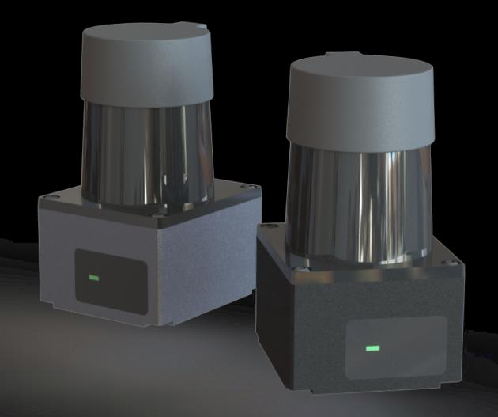

# PAC Lidar ROS Driver

## Table of contents

- [Supported Hardware](#supported-hardware)
- [Getting started](#getting-started)
- [ROS API](#ros-api)
- [Creators](#creators)

A ROS Driver which reads the raw data from the PAC Lidar and publishes the data as a laser_scan msg.

## Supported Hardware

Supported are all PAC30 and PAC60 with Ethernet connection.




## Getting started

The ROS driver only released as source code, and therefore can only be installed from source.

### Prerequisites

* Linux
* Working ROS-Distro
* Correctly setup PAC Lidar
* Connected PAC Lidar and a correctly setup ethernet network. Both the host and the sensor have to be in the same network.

### Installation

In the following instructions, replace `<rosdistro>` with the name of your ROS distro (e.g., `kinetic`).

#### From Source

```bash
source /opt/ros/<rosdistro>/setup.bash
mkdir -p ~/catkin_ws/src/
cd ~/catkin_ws/src/
git clone https://github.com/InfinityStar/PACLidarDriver-ROS.git
cd ..
catkin_make
source ~/catkin_ws/devel/setup.bash
```

### Starting

To start the driver the launch file "ViewLaserScan.launch" has to be started. For the driver to work correctly, the lidar ip and port have to be defined. These parameters can be passed to the lidar as arguments via launch file.

This will start the driver and the rviz.The point cloud of laser_scan should be showed on the rviz.

```
roslaunch paclidar_driver ViewLaserScan.launch pac_lidar_ip:=192.168.1.199 pac_lidar_port:=5000
```

To only start the driver,just start the launch file "PACLidarBringup.launch".

```
roslaunch paclidar_driver PACLidarBringup.launch pac_lidar_ip:=192.168.1.199 pac_lidar_port:=5000
```

### Troubleshooting

* Check if the lidar has power on and is connected to the host.
* Check if both sensor and host are in the same subnet e.g. 192.168.1
* Check if the launch file is called with the correct parameters for IP-addresses and ports.

## ROS API


### Advertised ROS Topics


`
/scan (type: sensor_msgs/LaserScan)
`

Publishes a scan from the lidar

`
~/pacLidar_state (type: paclidar_driver/LidarState)
`

Publishes the current state of the lidar.

### Advertised ROS Services

`
~/pacLidar_ctrl (type: paclidar_driver/PACLidarCtrl)
`

Set the configuration of lidar.

Srv Usage:

`
rosservice call /pacLidar_ctrl "lidarSpeed: 0
filterLev: 3"
`

- Support set 2 parameters at 1 command.

- When parameter is negtive, this parameter would be ignored.

- If user want to set a part of parameters, should set other parameters as negtive value.

### ROS parameters

| Parameter Name         | Type     | Default       | Information | Required | Passed |
| -------------          | ------   |-------        | ----------- | -------- | ------ |
| **Network Setting** |
| pac_lidar_ip           | String   | 192.168.1.199 | Lidar IP address.                                 | ✔ | ✔ |
| pac_lidar_port         | Integer  | 5000          | Lidar TCP port.                                   | ✔ | ✔ |
| link_timeout_sec       | Integer  | 10            | Lidar TCP connection timeout(*second*).           |   | ✔ |
| tcp_quick_ack          | bool     | False         | Whether to enable QuickAck to avoid delayed ack.  |   | ✔ |
| **Lidar Setting** |
| pac_lidar_speed        | Integer  | 10            | Lidar scan speed.Optional field: 10 15 20 25 30.  |   | ✔ |
| pac_lidar_filter_lev   | Integer  | 3             | Filtering level. Min:0(*none*) Max:6.             |   | ✔ |
| **Communication Setting** |
| pac_lidar_scan_topic   | String   | /scan         | The topic name of scan data.                      |   | ✔ |
| pac_lidar_state_topic  | String   | pacLidar_state | The topic name of the lidar state.               |   | ✔ |
| pac_lidar_ctrl_srv     | String   | pacLidar_ctrl | The service name of the lidar confguration        |   | ✔ |
| pac_lidar_frame_id     | String   | paclidar_link | The frame name of the lidar message               |   | ✔ |
| **Distace Limiting** |
| pac_lidar_range_min    | Double   | 0.00          | The scan data of the min range                    |   | ✔ |
| pac_lidar_range_max    | Double   | 60.0          | The scan data of the max range                    |   | ✔ |
| **Resolution Setting** |
| pac_angular_resolution | int      | 1             | The angle resolution of the scan data,Optinal:1 2 4,means **0.0625***1\|2\|4 |   | ✔ |
| **Angle Clipping** |
| pac_data_start_angle   | int      | 0             | Angle clipping start point.Range:[0-360].Note:The scan range is [start,start+scan_angle). |    | ✔ |
| pac_data_scan_angle    | int      | 360           | Total scanning angle.Direction: Counterclockwise; Range:[0-360] |    | ✔ |

## Creators

[@Roser](https://github.com/InfinityStar)